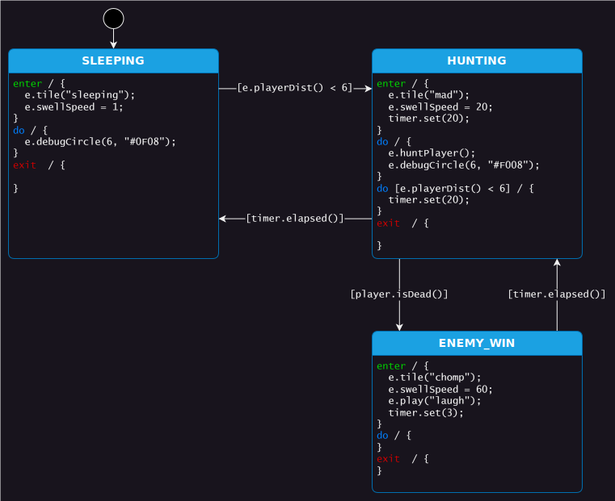

# Example Game Enemy "AI" State Machines
Let's explore enemy "AI" and state machines in a simple platformer game! 

Because we are more interested in state machines than a particular language or platform, we will use a simple JavaScript platformer based on the excellent [LittleJS](https://github.com/KilledByAPixel/LittleJS/) engine. It's super easy to hack and you don't need to download anything other than this example repo.

The more complicated state machines I've really enjoyed using StateSmith for modelling enemy "AI" with state machines.

This will guide us through first creating a very simple "AI" (Enemy0) and then adding more complexity to it. The final result (Enemy3) is pretty fun to play against. It has 15 high level behaviors, calls for help and dodges grenades. Sometimes, the enemy AI find grenades deeply fascinating and will get up close to study them before the fireworks start 😃.

# Open Source Visual Modelling
Enemy "AI" state machines can get pretty complicated, so we are going to use [StateSmith](https://github.com/StateSmith/StateSmith) to visually model them. StateSmith is a free and open source tool that supports 7 programming languages: C, C++, C#, JavaScript, TypeScript, Java, and Python (more coming). Full disclosure: I'm the author of StateSmith.

With StateSmith, you can visually model your state machines with draw.io or PlantUML and then generate code for your favorite language.

This example repo focuses on enemy "AI", but you can use StateSmith for any state machine you like. It's great for game development, IoT, robotics, and more. It is also handy for smaller state machines that have lots of transitions between states (e.g. a game character with many animations). One nice thing about draw.io and StateSmith is that you can embed images/gifs in your diagrams if you want.

# 4 Levels of Enemy "AI"
We are going to start super simple and gradually add more capabilities to our enemy "AI".

## Level 0: hunt & sleep
Get too close to the enemy and it will chase you. Otherwise, it will sleep.

> **[🕹️ TRY ENEMY 0 ONLINE HERE](https://adamfk.github.io/game-fsm-examples/?enemyId=0)**

## Level 1: timed hunting

 
 

# Acknowledgements
The majority of this code comes from the excellent [LittleJs platformer example](https://github.com/KilledByAPixel/LittleJS/tree/main/examples/platformer).

Some cleanup and modifications were made to fix type issues and add some features.
