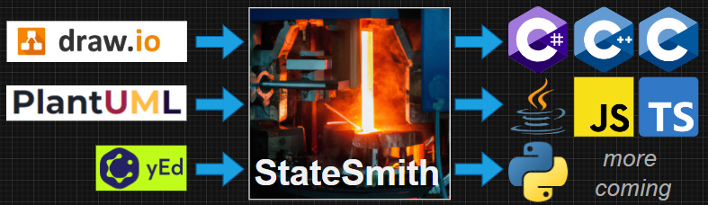

# Example Game Enemy "AI" State Machines
Let's explore enemy "AI" and state machines in a simple platformer game! 

Because we are more interested in state machines than a particular language or platform, we will use a simple JavaScript platformer based on the excellent [LittleJS](https://github.com/KilledByAPixel/LittleJS/) engine. It's super easy to hack and you don't need to download anything other than this example repo.

The more complicated state machines I've really enjoyed using StateSmith for modelling enemy "AI" with state machines.

This will guide us through first creating a very simple "AI" (Enemy0) and then adding more complexity to it. The final result (Enemy3) is pretty fun to play against. It has 15 high level behaviors, calls for help and dodges grenades. Sometimes, the enemy AI find grenades deeply fascinating and will get up close to study them before the fireworks start 😃.


<br>

# Open Source Visual Modelling
Enemy "AI" state machines can get pretty complicated, so we are going to use [StateSmith](https://github.com/StateSmith/StateSmith) to visually model them. 

StateSmith is a free and open source tool that supports 7 programming languages: `C`, `C++`, `C#`, `JavaScript`, `TypeScript`, `Java`, and `Python` (more coming). Full disclosure: I'm the author of StateSmith.



With StateSmith, you can visually model your state machines with draw.io or PlantUML and then generate code for your favorite language.


This example repo focuses on enemy "AI", but you can use StateSmith for any state machine you like. It's great for game development, IoT, robotics, and more. It is also handy for smaller state machines that have lots of transitions between states (e.g. a game character with many animations). One nice thing about draw.io and StateSmith is that you can embed images/gifs in your diagrams if you want.


<br>

# 4 Levels of Enemy "AI"
We are going to start super simple and gradually add more capabilities to our enemy "AI".


## Level 0: hunt & sleep
Get too close to the blob and it will chase you. Otherwise, it will sleep.

> **[🕹️ TRY ENEMY 0 ONLINE HERE](https://adamfk.github.io/game-fsm-examples/?enemyId=0)**


In the below diagram the `e` variable is an instance of the `Enemy0` blob class. There are lot of different ways to connect your state machine to your game objects. This is just one way to do it. The hand written `Enemy0` class has an instance of the `Enemy0Sm` state machine (generated by StateSmith) and the state machine has a reference back to `Enemy0` so it can call methods on it. If your target language supports inheritance, you could have the state machine inherit from the game object class (`Enemy0` in this case).


<br>

## Level 1: timed hunting & celebration
Get too close and the blob will hunt you for 20 seconds before going back to sleep. The timer is reset while you are too close.

> **[🕹️ TRY ENEMY 1 ONLINE HERE](https://adamfk.github.io/game-fsm-examples/?enemyId=1)**


<br>

## Level 2: charged attacks
Come inside the red ring and they start hunting. Come inside the yellow ring and they will begin a charge attack.

> **[🕹️ TRY ENEMY 2 ONLINE HERE](https://adamfk.github.io/game-fsm-examples/?enemyId=2)**


We've started nesting states now. Inside of our HUNTING state, we have a simple `HUNT` state (move towards player) a `CHARGE` attack (rotate horizontal and then rush towards player).


One really powerful technique used here is that we are mixing hand coded state machines and state machines generated by StateSmith in the `CHARGE` state. This allows us to have the best of both worlds. We can use StateSmith for the more complex behaviors and hand code the simpler ones.


The `Enemy2` blob has the following code that is called by the StateSmith state machine:

```javascript
// store the target vector & start the timer
chargeEnter() {
    this.targetVec = this.normalVecToPlayer();
    this.chargeTimer.set();
}

// rotate blob towards horizontal and then charge
chargeDo() {
    const chargeRatio = this.chargeTimer.get() / this.chargeMaxTime;
    this.angle = chargeRatio * PI/2;

    // fire!
    if (this.isChargeDone()) {
        this.velocity.x = this.targetVec.x;

        // slow it down a bit if we are in the air (no friction)
        if (!this.groundObject) {
            this.velocity.x *= 0.3;
        }
    }
}

// reset the angle
chargeExit() {
    this.angle = 0;
}

isChargeDone() {
    return this.chargeTimer.get() >= this.chargeMaxTime;
}
```

<br>

## Level 3: high level behaviors
Here is where the blobs start to come to life.

> **[🕹️ TRY ENEMY 3 ONLINE HERE](https://adamfk.github.io/game-fsm-examples/?enemyId=3)**

We build on previous strategy of mixing hand coded "action sequence" behaviors and StateSmith generated states. To make us more efficient, we use some helper classes to create "action sequence" behaviors.

```javascript
// When a blob is waking up from sleep
class Waking1 extends EnemyBlobSequence {
    /**
     * @param {EnemyBlob} enemyBlob
     */
    constructor(enemyBlob) {
        super(enemyBlob);

        this.addTileAction("groggy", 0.5);
        this.addTileAction("sleeping", 2);

        this.addTileAction("groggy", 0.5);
        this.addTileAction("sleeping", 1.5);

        this.addTileAction("groggy", 2);
    }
}
```

TODO:
- explain enter and exit points
- explain how to enter/exit collapsed states


<br>
<br>

# Acknowledgements
The majority of this code comes from the excellent [LittleJs platformer example](https://github.com/KilledByAPixel/LittleJS/tree/main/examples/platformer).

Some cleanup and modifications were made to fix type issues and add some features.
